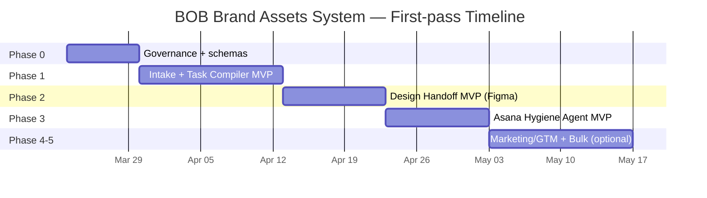

# Curaden BOB Brand-Asset Agentic Program for Claude Code in GSD

## Executive summary and information needs

**Executive summary**  
Curaden’s 2026 internal materials for the BOB App indicate a frontend rebuild with **new UX and a new design system**, including a possible **2D → 3D visualization** shift. fileciteturn45file1L1-L1 At the same time, internal QA coverage explicitly flags that there is **no formal design system yet** and notes CSS/visual inconsistencies as defects to track. fileciteturn32file1L1-L1 Internal references also point to a **BOB Design System in Figma** via the “Figma Libraries” hub. fileciteturn32file4L1-L1

Taken together, the highest-value “agentic” program for BOB brand-asset work is: **standardize how brand assets and design tokens flow from Figma → Asana → Notion**, keep the two boards clean and consistently updated with short “update snippets” in task comments, and gate all write actions through explicit approvals and schemas. Asana supports modeling workflow stages as **sections** (which map directly to board/list views) and then automating stage transitions with rules and/or a workflow stage field. citeturn0search0turn0search5

**Important Atlassian tooling notice (from the Atlassian Remote MCP server output):** after **June 30, 2026**, the HTTP+SSE transport endpoint at `https://mcp.atlassian.com/v1/sse` is scheduled to stop being supported; clients should move to the Streamable HTTP endpoint at `https://mcp.atlassian.com/v1/mcp`. (This affects how you connect Atlassian sources via MCP.)

**Information needs used to drive this research (brand-asset focus)**  
The plan and skills below are based on the following minimal set of information needs:

- What the 2026 BOB program says about **design system/brand asset needs** (e.g., “new UX”, “new design system”, “2D → 3D”). fileciteturn45file1L1-L1
- Evidence of **design-system maturity gaps** to fix (e.g., QA flags about “no formal design system yet”). fileciteturn32file1L1-L1
- Where BOB’s design assets and libraries live (Figma references; the internal “Figma Libraries” hub). fileciteturn32file4L1-L1
- Which Curaden internal systems are intended to be the operational hub (Notion “App Hub”, asset storage, Asana processes/governance). fileciteturn29file4L1-L1 fileciteturn31file0L1-L1 fileciteturn31file2L1-L1
- Who the stakeholders/owners are for the 2026 initiatives (product/tech + marketing + external partners). fileciteturn33file4L1-L1
- Practical, official integration requirements and safe permission models for Asana/Notion/Figma/Miro/Webex/Outlook/GitHub. citeturn0search2turn6search1turn0search3turn0search1turn1search0turn3search2turn2search1turn2search0

## Internal 2026 findings and one-line framing answers

### Research coverage and connector limitations

- **Notion**: successful search and identification of relevant BOB and operations pages/databases (2026). fileciteturn29file0L1-L1 fileciteturn32file1L1-L1 fileciteturn32file4L1-L1  
- **Asana**: project discovery succeeded (BOB App project exists); however the connector returns object metadata without line-citable excerpts. (Used for inventory only.)  
- **Atlassian Rovo**: the unified `/search` tool call failed (“Tool search not found”), so **Rovo search is effectively blocked** in this environment. As a workaround, Confluence space discovery + CQL search worked, but returned mostly older (2025) artifacts and results are not line-citable in `filecite` format; therefore, **the one-line framing answers below rely only on 2026 Notion artifacts** as requested.

### One-line framing answers based only on 2026 Curaden/Curaprox internal docs

**Core**: Deliver BOB’s **new UX + new design system** (supporting the planned “2D → 3D visualization” direction) by producing a complete, governed **BOB brand-asset system**—tokens, components, and asset packs that can be implemented consistently. fileciteturn45file1L1-L1  

**Systems**: Use the internal **Curaden App Hub** as the navigation spine across Notion/Asana/Confluence, manage brand-assets in Notion (including an “Assets” database), and execute work through Asana processes/governance while sourcing design truth from the BOB Figma library reference. fileciteturn29file4L1-L1 fileciteturn29file9L1-L1 fileciteturn31file0L1-L1 fileciteturn31file2L1-L1 fileciteturn32file4L1-L1  

**Roles**: Stakeholder coverage includes product leadership and external design/front-end support, plus **Marketing** involvement for 2026 initiatives (roles are present, but exact RACI must still be formalized). fileciteturn33file4L1-L1  

**Success**: A “usable and clean” BOB UI/brand experience where **design-system gaps are closed** (QA explicitly notes “no formal design system yet” and visual/CSS inconsistencies to treat as defects), so assets/tokens/components are consistently applied across screens. fileciteturn32file1L1-L1  

## Recommended agents for BOB brand-asset operations

### Operating principle

Do not build “big general agents.” Build **narrow operators** with:
- a strict input schema,
- explicit permissions,
- safe write gates (approvals),
- deterministic mapping rules (especially for Kanban routing).

Asana’s own workflow model supports treating **sections as stages**, visible in board and list views. citeturn0search0 One robust pattern is: **use a workflow-stage field + rules to move tasks** automatically. citeturn0search5 Another is to directly move tasks to the correct section using the Asana API endpoint that adds a task to a section (required scope: `tasks:write`). citeturn0search2

### Agent catalog table

Each agent below is optimized for BOB brand-asset delivery and for your stated need to keep Asana maintained via update snippets and Kanban routing.

| Agent | Purpose | Triggers | Inputs | Outputs | Permissions required | Owner | ChatGPT vs Claude role split | MVP vs later |
|---|---|---|---|---|---|---|---|---|
| Intake | Normalize brand-asset requests (logo, icons, app store screenshots, typography, 3D style frames, templates) into structured briefs | New request in Webex/Outlook; new Asana intake task; manual “/intake” | Link(s) + short description + requested channel + due window | “Asset Brief” object + routing recommendation | Read: Webex/Outlook; Write: Notion brief page; optional Asana task creation | Brand/Design Ops | ChatGPT: clarify and structure; Claude: enforce schema + create/attach records | MVP |
| Task Compiler | Convert a brief into correctly-scoped Asana tasks (with consistent naming, deliverables, and acceptance criteria) and route to the right stage | Intake accepted; “compile” command; weekly planning | Asset Brief + related Figma links + campaign dates | Task bundle + dependencies + Kanban stage assignment + comment snippet draft | Asana write: `tasks:write`; optionally comment: `stories:write` citeturn0search2turn6search1 | PM/Brand Ops | ChatGPT: decomposition + AC; Claude: apply mapping + push tasks + ensure idempotency | MVP |
| Meeting Intelligence | Extract decisions, deliverables, and approval needs from brand/design meetings | Webex meeting ends; transcript available; workshop notes | Transcript + attendee list + artifacts | Decision log + action items + “approval needed” flags + Asana tasks (guarded) | Webex read; Notion write; Asana write (guarded) | Design Ops | ChatGPT: summarize + extract; Claude: validate schema + synchronize artifacts | MVP |
| Project Secretary | Maintain a single brand-asset “source of truth” per milestone (status, blockers, changes, handoffs), keep the “liquid page” current | Daily/weekly schedule; after stage changes | Asana state + approvals + Figma handoff updates | Weekly status note + “done / next / blocked” + stakeholder update snippet | Read Asana + Notion write; optional Webex write | Product/Brand lead | ChatGPT: narrative updates; Claude: structured publishing + link hygiene | MVP |
| Design Handoff | Translate Figma frames and library changes into build-ready assets/tokens/components tasks and export lists | Figma comment/tag “ready”; library publish; manual request | Figma file URL + frames + comments | “Handoff Packet” + export checklist + tasks + QA checklist | Figma read via OAuth (scope like `file_content:read`) citeturn0search1turn0search4; Asana write | Design lead | ChatGPT: interpret design intent + edge cases; Claude: create tasks + enforce checklists | MVP |
| Marketing/GTM | Build launch-ready asset packages (store listings, website kit, email/social templates) aligned to the new brand assets | Milestone planned; release candidate; “GTM start” | Approved brand assets + feature scope | GTM checklist + copy drafts + task bundle | Notion write; Asana write; Outlook draft (optional) | Marketing lead | ChatGPT: copy + packaging; Claude: taskify + track approvals | Later |
| Asana bulk (safe) | Create large numbers of repetitive asset tasks (localizations, screenshot variants, channel variants) with safety gates | Pre-approved bulk import request | CSV/JSON list of tasks and metadata | Bulk-created tasks + “bulk created” audit comment | Asana write + rate limits; approvals required | PMO/Brand Ops | ChatGPT: validate + dedupe; Claude: bulk create + error retries | Later |
| Communication agent | Post concise updates to shared channels (Webex spaces, Outlook summaries) with links to source tasks/pages | Weekly status; “approval needed”; “ready for review” | Status report + audience | Channel post + email draft + pinned links | Webex write (tight scopes); Outlook write (Graph permissions) | Ops/EA | ChatGPT: write crisp update; Claude: post/send + log | Later |

## GSD scaffold for BOB brand-asset delivery

### Why GSD and how it maps to your Claude Code build

GSD emphasizes “context engineering” via a stable set of project documents (`PROJECT.md`, `REQUIREMENTS.md`, `ROADMAP.md`, `STATE.md`, etc.) and **fresh, atomic plans** to avoid quality degradation in long sessions. citeturn4search4turn2search5 It is commonly used with Claude Code, which can be customized through persistent `CLAUDE.md` files and bootstrapped using `/init`. citeturn3search0turn2search6

> Implementation note: direct access to the user-referenced GitHub repo URL was not possible in this environment (GitHub fetch returned an unexpected status code), so the scaffold below follows the documented file concepts described via GSD’s public site and derived docs. citeturn4search4turn2search5

### Recommended directory layout (ready to create)

```text
.planning/
  PROJECT.md
  REQUIREMENTS.md
  ROADMAP.md
  STATE.md
  research/
    01-brand-asset-inventory.md
    01-figma-library-plan.md
    01-approvals-and-legal.md
    01-pitfalls-and-risk.md
  phase-01/
    01-CONTEXT.md
    01-1-PLAN.md
    01-VERIFICATION.md
    01-UAT.md
    01-SUMMARY.md
  phase-02/
  ...
CLAUDE.md
skills/
  meeting-intelligence.md
  task-compiler.md
  project-secretary.md
  design-handoff.md
  engineering-executor.md
```

### First-pass content for the scaffold files

#### PROJECT.md (BOB brand-asset milestone oriented)

```md
# PROJECT: BOB Brand Assets System (Design System + Asset Ops)

## What this is
A brand-asset delivery system for the BOB App overhaul that produces and governs:
- BOB design system (tokens/components)
- BOB UI asset packs (icons, illustrations, 2D/3D visual style)
- BOB marketing/GTM asset kits (app store, web, email/social templates)

## Core value
BOB brand assets ship once and are reused consistently, with traceable approvals and clean handoffs from design → implementation → GTM.

## Context (internal anchors)
- BOB overhaul requires new UX and new design system; 2D → 3D is under consideration.
- QA indicates no formal design system yet and visual/CSS inconsistencies must be treated as defects.

## Systems of record
- Design truth: Figma library and files (BOB Design System link in internal “Figma Libraries”)
- Work tracking + stages: Asana board(s)
- Project memory + asset indexing: Notion (App Hub + Assets db)

## Out of scope (v1)
- Full automation without approvals
- Automated publishing to public marketing surfaces
- Uncontrolled bulk creation in Asana
```

#### REQUIREMENTS.md (checkable)

```md
# REQUIREMENTS — BOB Brand Assets System

## Naming convention
REQ-BA-XX = Brand Asset requirement

## v1 requirements (this milestone)
REQ-BA-01 Brand asset taxonomy exists (icons, logo, typography, color, illustration/3D, templates, store assets).
REQ-BA-02 One Figma-based “source of truth” library reference exists and is linked from Notion/App Hub.
REQ-BA-03 Every asset deliverable has an owner, due window, and acceptance criteria in Asana.
REQ-BA-04 Every asset deliverable has an approval record (who approved, when, what changed).
REQ-BA-05 Asana hygiene agent posts standardized update snippets and routes tasks to correct Kanban stages.
REQ-BA-06 Export + implementation checklists exist for each asset type (e.g., iOS/Android icon sets, store screenshots).
REQ-BA-07 Weekly “brand asset status” is published automatically with minimal manual editing (<=10 minutes).

## v2 requirements (later)
REQ-BA-20 Bulk localization variants (store screenshots per locale) with safe bulk tooling.
REQ-BA-21 GTM automation (email drafts, web kit packaging, channel notifications).
REQ-BA-22 Automated “diff detection” for Figma library changes → required downstream updates.

## Non-goals
- Replacing Asana/Notion/Figma
- Making clinical claims decisions autonomously
```

#### ROADMAP.md (phases + verification)

```md
# ROADMAP — BOB Brand Assets System

## Phase 0: Governance + schema
Goal: Define process rules, schemas, permissions, and approval gating.

Verification:
- Schemas validated on 5 example briefs.
- Approval policy documented and accepted.

## Phase 1: Intake + Task Compiler MVP (Asana + Notion)
Goal: Convert requests into clean branded asset task bundles with consistent stages.

Verification:
- 20 brand-asset requests processed.
- >=80% tasks accepted without rewrite.
- No duplicate tasks for the same asset request.

## Phase 2: Design Handoff MVP (Figma → Asana)
Goal: Figma file/frames → handoff packet + export checklist + implementation tasks.

Verification:
- 5 handoffs, each yields usable task bundle + export checklist.

## Phase 3: Asana Hygiene Agent (comment snippets + Kanban routing)
Goal: Standardized agent update comments + deterministic stage routing.

Verification:
- 50 routed events with 0 unintended stage moves.
- No spam (<=1 agent snippet per task per stage change).

## Phase 4: Marketing/GTM packaging (optional in v1; likely v2)
Goal: App store/web/email/social asset kit tasks and approval chain.

Verification:
- One release cycle packaged end-to-end.

## Phase 5: Bulk + scale
Goal: Safe bulk creation for variants and localization packs.

Verification:
- Bulk mode requires explicit approval and rate limits.
```

#### STATE.md (keep short and current)

```md
# STATE — BOB Brand Assets System

Current phase: Phase 1 (Intake + Task Compiler MVP)

Key decisions
- Asana is task system of record; Notion holds asset index and brand memory.
- Figma is design source of truth; exports are tracked via checklists.

Blockers / risks
- Missing explicit RACI for approvals.
- Risk of task spam without idempotency and rate limits.

Next actions
- Define Kanban stages and routing rules for the two main boards.
- Implement “agent update snippet” template and schema validation.
```

#### research/ notes (initial set)

```md
# research — phase 01: brand asset ops

## Brand asset inventory
- List required asset types and downstream consumers (app, web, store, GTM).
- Map each to export specs and file naming conventions.

## Figma library plan
- Identify BOB library/files and decide: single source-of-truth file vs layered system.
- Define tokens/components strategy.

## Approval + legal constraints
- Define what requires marketing approval vs design approval vs product approval.
- Define what content claims must be reviewed.

## Pitfalls
- Task duplication
- Unclear stage mapping between boards
- Inconsistent asset naming and export formats
```

#### Per-phase PLAN.md (first-pass for Phase 3, since you explicitly want Asana maintenance + routing)

```md
# PLAN — Phase 3: Asana Hygiene Agent (Update Snippets + Kanban Routing)

## Goal
Maintain Asana hygiene for BOB brand-asset work by posting standardized update snippets and moving tasks into correct Kanban stages with explicit directives.

## Inputs
- Two target Asana project IDs (boards)
- Stage mapping (directive → section/stage)
- Comment snippet template

## Tasks (atomic)
1) Build directive parser
   - Deliverable: parser that maps phrases like "proceed with implementation" → IMPLEMENTATION stage; "feedback point needed" → NEEDS_FEEDBACK stage
   - Verification: 30 test strings map correctly; unknown phrases return "no-op"

2) Build comment writer
   - Deliverable: function that posts exactly one standardized update snippet per event
   - Verification: idempotency check prevents duplicates on retries

3) Build Kanban router
   - Deliverable: section move OR stage-field update (configurable)
   - Verification: 50 routing events; 0 unintended moves

4) Add safety + audit
   - Deliverable: allowlist of actors; dry-run mode; audit log per write
   - Verification: dry-run produces "would move to X" comment without moving task

## Definition of done
- Agent runs end-to-end in dry-run then in write mode
- All writes are logged with correlation IDs
- Human approval gates exist for bulk operations
```

## Claude skill Markdown deliverables

The five skills below are **adapted specifically for BOB brand-asset work** and are written as “ready-to-drop” `.md` files you can place in `skills/`.

> These skill specs assume you build a small orchestration layer (script/service) that:
> - enforces permission scopes,
> - validates JSON schemas,
> - and gates writes (especially bulk operations).

### skills/meeting-intelligence.md

```md
# Skill: meeting-intelligence (BOB Brand Assets)

## Purpose
Turn BOB brand/design/marketing meetings into operational outputs:
- Decisions (what’s approved, what changed)
- Action items (asset tasks)
- Approval needs (who must sign off)
- Risks/blockers

## Triggers
- Webex meeting transcript available
- Manual prompt with pasted notes

## Sample prompts
- "Extract decisions and brand-asset actions from this meeting transcript. Create an approval list."
- "Summarize the meeting into a Decision Log + Asana-ready brand asset tasks."

## Input JSON schema
{
  "meeting": {
    "title": "string",
    "date": "YYYY-MM-DD",
    "attendees": ["string"],
    "transcript": "string|null",
    "notes": "string|null"
  },
  "context": {
    "initiative": "BOB Brand Assets",
    "release_window": "string|null",
    "links": ["string"]
  }
}

## Output JSON schema
{
  "summary": "string",
  "decisions": [
    {
      "decision": "string",
      "approved_by": ["string"],
      "scope_impacted": ["string"],
      "timestamp_hint": "string|null"
    }
  ],
  "action_items": [
    {
      "asset_type": "logo|icon|typography|color|illustration|3D|template|store_screenshot|web_asset|other",
      "title": "string",
      "description": "string",
      "owner": "string|null",
      "due_date": "YYYY-MM-DD|null",
      "acceptance_criteria": ["string"],
      "approval_required": true,
      "links": ["string"]
    }
  ],
  "risks": [
    {"risk": "string", "mitigation": "string|null"}
  ],
  "followups": ["string"],
  "confidence": {
    "level": "low|medium|high",
    "notes": "string"
  }
}

## Permission scopes (recommended)
Read:
- Webex transcript/notes (do not request compliance scopes unless necessary)
Write (guarded):
- Notion decision log update
- Asana task creation (requires tasks:write)
- Asana comment post (requires stories:write)

Notes:
- If posting comments via API, Asana stories require `stories:write`. (Asana API: Create a story on a task)
- If routing tasks by section, Asana requires `tasks:write` to add task to section.

## Error handling
- If transcript is missing: use notes; if both missing, return confidence.level=low and request input.
- If approvals unclear: set approved_by=[] and add followups asking who approves.
- Never fabricate dates; use null where unknown.

## Verification tests
1) Given a short transcript with 2 decisions + 3 action items:
   - output contains 2 decisions, 3 action_items
   - each action item has approval_required=true and >=1 acceptance criterion
2) Output must be valid JSON and conform to schema (no extra keys).
```

### skills/task-compiler.md

```md
# Skill: task-compiler (BOB Brand Assets)

## Purpose
Convert a structured Brand Asset Brief into a clean, non-spammy Asana task bundle:
- Proper naming
- Deliverables and acceptance criteria
- Correct Kanban routing (stage/section)
- Dedupe checks

## Triggers
- Intake brief accepted
- Manual "compile tasks" request
- Weekly backlog grooming

## Sample prompts
- "Compile an asset task bundle for BOB App Store screenshots and brand templates."
- "Turn this brief into Asana tasks with acceptance criteria and a stage recommendation."

## Input JSON schema
{
  "brief": {
    "id": "string",
    "title": "string",
    "problem": "string",
    "desired_outcome": "string",
    "asset_types": ["string"],
    "channels": ["app|web|store|email|social|internal"],
    "constraints": ["string"],
    "links": ["string"],
    "approvals_needed": ["design|marketing|product|legal"],
    "requested_by": "string",
    "urgency": "low|medium|high"
  },
  "asana": {
    "target_projects": [
      {"project_gid": "string", "default_section_gid": "string|null"}
    ],
    "stage_map": [
      {"directive": "proceed_with_implementation", "section_gid": "string"},
      {"directive": "feedback_point_needed", "section_gid": "string"}
    ]
  }
}

## Output JSON schema
{
  "task_bundle": {
    "epic_title": "string",
    "tasks": [
      {
        "ref_id": "string",
        "title": "string",
        "description": "string",
        "owner": "string|null",
        "due_date": "YYYY-MM-DD|null",
        "stage_directive": "proceed_with_implementation|feedback_point_needed|needs_review|blocked|draft",
        "dependencies": ["ref_id"],
        "acceptance_criteria": ["string"],
        "export_checklist": ["string"],
        "approval_required": true,
        "links": ["string"]
      }
    ]
  },
  "dedupe": {
    "possible_duplicates": ["string"],
    "notes": "string"
  },
  "write_plan": {
    "create_tasks": true,
    "post_update_comments": false,
    "route_to_sections": true
  }
}

## Permission scopes (recommended)
Asana write actions:
- Create tasks and move to sections: `tasks:write` (Adding task to section removes it from other sections in the project).
- Post standardized update snippets: `stories:write` (Create story on task).
Asana workflow guidance:
- Asana workflow builder stages correspond to project sections in board/list views.

## Error handling
- If multiple target_projects are provided, require explicit user selection unless routing rules exist.
- If stage directive is unknown, set stage_directive="draft" and do not route automatically.
- If dedupe risk exists, set write_plan.create_tasks=false and return a proposal for review.

## Verification tests
- Every task must have >=2 acceptance criteria OR explicitly state why not.
- No more than 12 tasks produced unless "bulk mode" is explicitly requested.
- Output must be schema-valid JSON.
```

### skills/project-secretary.md

```md
# Skill: project-secretary (BOB Brand Assets)

## Purpose
Maintain a living brand-asset status loop:
- Keep the “brand asset register” current
- Produce weekly status updates (Done / Next / Blocked)
- Flag approval bottlenecks and missing handoffs

## Triggers
- Weekly scheduled run
- After a milestone decision is recorded
- After significant stage movement in Asana (e.g., many tasks enter "Needs Feedback")

## Sample prompts
- "Produce a weekly BOB brand assets status update with approvals needed."
- "Update the STATE snapshot: what's blocked, what's next, what changed."

## Input JSON schema
{
  "portfolio": {
    "initiative": "BOB Brand Assets",
    "asana_project_gids": ["string"],
    "notion_state_page_id": "string|null"
  },
  "window": {"start": "YYYY-MM-DD", "end": "YYYY-MM-DD"}
}

## Output JSON schema
{
  "state_snapshot": {
    "current_focus": ["string"],
    "completed": ["string"],
    "in_progress": ["string"],
    "blocked": [
      {"item": "string", "blocked_by": "string", "next_step": "string"}
    ],
    "approvals_needed": [
      {"asset": "string", "approver_role": "design|marketing|product|legal", "due": "YYYY-MM-DD|null"}
    ]
  },
  "stakeholder_update": {
    "short": "string",
    "detailed": "string"
  },
  "publish": {
    "update_notion": true,
    "post_webex": false,
    "draft_outlook": false
  }
}

## Permission scopes (recommended)
Read:
- Asana tasks across project_gids
Write (guarded):
- Notion page update (page must be shared with integration)
- Webex post (only to allowlisted spaces)
- Outlook draft (Graph permissions must be least-privilege)

## Error handling
- If Notion page missing: publish.update_notion=false and include remediation.
- If too many tasks changed: summarize to top 10 and attach a link to Asana filtered view.

## Verification tests
- stakeholder_update.short must be <= 800 characters (channel-friendly).
- All "blocked" entries include a next_step.
- Output schema validation.
```

### skills/design-handoff.md

```md
# Skill: design-handoff (BOB Brand Assets)

## Purpose
Convert Figma brand asset work into implementation-ready packets:
- Export checklists (by platform/channel)
- Required file naming
- Token/component implications
- Asana tasks with acceptance criteria

## Triggers
- Figma file link posted to a task
- Library updates published
- Manual "create handoff packet" request

## Sample prompts
- "Create a handoff packet for the updated BOB icon set and store screenshots."
- "Translate these frames into export checklists and Asana tasks."

## Input JSON schema
{
  "figma": {
    "file_url": "string",
    "frames": ["string|null"],
    "comments": "string|null"
  },
  "asset_context": {
    "asset_type": "icon|logo|typography|color|illustration|3D|template|store_screenshot|web_asset|other",
    "platforms": ["ios|android|web"],
    "locales": ["string"],
    "release_window": "string|null"
  }
}

## Output JSON schema
{
  "handoff_packet": {
    "overview": "string",
    "export_specs": [
      {"target": "ios|android|web|store|email|social", "format": "string", "sizes": ["string"], "notes": "string"}
    ],
    "naming_convention": "string",
    "open_questions": ["string"],
    "qa_checks": ["string"]
  },
  "asana_tasks": [
    {
      "title": "string",
      "description": "string",
      "acceptance_criteria": ["string"],
      "approval_required": true,
      "links": ["string"]
    }
  ],
  "confidence": {"level": "low|medium|high", "notes": "string"}
}

## Permission scopes (recommended)
Figma:
- Use OAuth app where possible; reading file contents requires a scope like `file_content:read`.
Notion:
- If storing packet summaries in Notion, the destination page/database must be shared to the integration.
Asana:
- Task creation and routing require `tasks:write`.

## Error handling
- If Figma access fails: return confidence=low and request export or access grant.
- If frames unspecified: produce generic export specs, but add open_questions requiring precise frames.

## Verification tests
- Every export_specs entry must specify target + format.
- Every Asana task must include >=2 acceptance criteria.
- JSON schema validation.
```

### skills/engineering-executor.md

```md
# Skill: engineering-executor (BOB Brand Assets)

## Purpose
Safely implement brand-asset outputs in repos:
- Add exported asset files
- Update theme tokens/constants
- Add build scripts (if needed) for asset pipelines
- Produce verification evidence (lint/test/build outputs)

## Triggers
- Approved implementation task exists
- "Execute implementation" command invoked

## Sample prompts
- "Implement the new icon set in the repo. Update references and run checks."
- "Add the new theme tokens and verify build passes."

## Input JSON schema
{
  "repo": {
    "path": "string",
    "branch": "string"
  },
  "implementation_packet": {
    "tasks": ["string"],
    "files_expected": ["string"],
    "asset_paths": ["string"],
    "verification_commands": ["string"]
  },
  "constraints": {
    "allow_network": false,
    "allowed_commands": ["string"]
  }
}

## Output JSON schema
{
  "changes": [
    {"file": "string", "summary": "string"}
  ],
  "verification": [
    {"command": "string", "result": "pass|fail", "log_excerpt": "string"}
  ],
  "ready_for_pr": true,
  "notes": "string"
}

## Permission scopes (recommended)
- Repo write permissions must be limited (prefer GitHub App with fine-grained permissions for automation).
- Require explicit human approval before any push/PR creation.
- Keep audit logs (what changed, why, and based on which ticket).

## Error handling
- If verification fails:
  - attempt one minimal fix loop
  - then stop and report ready_for_pr=false
- If a command is outside allowlist: do not run; request approval.

## Verification tests
- Must run at least one verification command if provided.
- ready_for_pr=false if any verification is "fail".
- Output schema validation.
```

## Roadmap, integration checklist, and estimate

### Architecture diagram for brand-asset work

```mermaid
flowchart TB
  subgraph Sources
    W[Webex meeting transcript/notes]
    O[Outlook intake email]
    M[Miro workshop boards]
    F[Figma libraries + files]
  end

  subgraph OpsCore["BOB Brand Asset Ops Core"]
    IA[Intake Agent]
    TC[Task Compiler]
    DH[Design Handoff]
    PS[Project Secretary]
    AG[Asana Hygiene Agent\n(update snippets + routing)]
    GATE[Approvals + Policy Gate]
  end

  subgraph SystemsOfRecord
    A[Asana boards (Kanban stages)]
    N[Notion App Hub + Asset register]
    GH[GitHub repo (asset implementation)]
  end

  Sources --> IA --> GATE
  GATE --> TC --> A
  F --> DH --> GATE --> A
  A --> PS --> N
  A --> AG --> A
  DH --> GH
```

### Milestones and sequencing table

| Phase | Milestone | Primary output | Verification criteria |
|---|---|---|---|
| Phase 0 | Governance + schemas | Asset taxonomy + approval rules + stage map | 5 sample briefs validated; approval model accepted |
| Phase 1 | Intake + Task Compiler MVP | Consistent Asana task bundles for brand assets | 20 requests; ≥80% “no rewrite”; dedupe prevents duplicates |
| Phase 2 | Design Handoff MVP | Figma → handoff packet + export checklists + tasks | 5 handoffs; each yields export list + QA checks |
| Phase 3 | Asana Hygiene Agent MVP | Update-snippet comments + deterministic Kanban routing | 50 route events; 0 unintended moves; no spam (≤1 update per event) |
| Phase 4 | Marketing/GTM add-on | App store + web + email/social asset kits | One release packaged end-to-end; approvals recorded |
| Phase 5 | Bulk + scale | Bulk creation for variants/locales | Bulk actions require explicit approval + rate limits |

### Mermaid timeline (first-pass)



### Integration checklist with security and approvals

| System | Integration approach | Key scopes/requirements | Security & approval constraints |
|---|---|---|---|
| Asana | API + rules + (optional) webhooks | Move tasks via sections endpoint requires `tasks:write` and removes from other sections. citeturn0search2 Comments require `stories:write`. citeturn6search1 | For webhooks, verify HMAC signature using `X-Hook-Secret`/`X-Hook-Signature`. citeturn6search0 Use idempotency to prevent duplicate comments/moves. |
| Notion | Internal integration | Pages/databases must be manually shared to the integration; keep token secret (env var / secret manager). citeturn0search3 | Only share “Brand Assets” and “BOB Hub” pages to limit blast radius. |
| Figma | OAuth app preferred | OAuth app recommended; can be reassigned by admins; scope example: `file_content:read`. citeturn0search1turn0search4 | Treat Figma as the design source of truth; never overwrite without explicit approval. |
| Miro | OAuth 2.0 | Access tokens often expire in ~60 minutes; refresh token ~60 days (expiring token model). citeturn1search0turn1search3 | Store refresh tokens securely; restrict to read-only for MVP. |
| Webex | OAuth integration | `spark:kms` is required to interact with encrypted content (messages). citeturn3search2 Compliance scopes like `spark-compliance:events_read` are powerful and require compliance officer role. citeturn1search1 | For MVP, avoid compliance scopes; ingest transcripts via approved exports or minimal read scopes. |
| Outlook | Microsoft Graph | Apply least privilege; request only required permissions (Microsoft explicitly recommends least privilege). citeturn2search1 | Use “draft-only” mode initially; require human send/approve for external comms. |
| GitHub | GitHub App preferred | GitHub states GitHub Apps are generally preferred over OAuth apps due to fine-grained permissions and short-lived tokens. citeturn2search0 | Require human approval before PR creation; restrict repo access to BOB-related repos only. |
| Claude Code | Repo-local agent | Use `CLAUDE.md` to provide persistent context; `/init` can generate a starter config; keep file concise. citeturn3search0turn2search6 | Disallow destructive actions (delete/mass move) without explicit approval; maintain audit logs. |

### Rough implementation estimate and risks

**Effort estimate (person-weeks, first-pass)**  
Assuming 1 PM/Brand Ops (0.5), 1–2 engineers, and design/marketing reviewers (part-time):

- Phase 0 (governance + schemas + stage mapping): **1–2 person-weeks**
- Phase 1 (intake + task compiler MVP): **3–5 person-weeks**
- Phase 2 (design handoff MVP): **2–4 person-weeks**
- Phase 3 (Asana hygiene agent MVP): **2–4 person-weeks**
- Phase 4–5 (GTM + bulk scaling): **3–6 person-weeks**

Total MVP to “operationally useful”: **~8–15 person-weeks**, depending mainly on how automated you want Outlook/Webex ingestion to be.

**Key risks and mitigations**
- **Task spam / accidental moves**: use Asana’s workflow-stage pattern (sections as stages) and enforce idempotency; only one agent snippet per event; optionally route via a single-select stage field + rules. citeturn0search0turn0search5turn6search3  
- **Webhook spoofing**: if using webhooks, verify `X-Hook-Signature` using the handshake secret. citeturn6search0  
- **Over-privileged integrations**: Notion requires explicit page sharing; Microsoft Graph recommends least privilege; GitHub Apps provide fine-grained permissions—use them. citeturn0search3turn2search1turn2search0  
- **Design-system drift** (assets exported ad hoc): treat the integrated “Figma library → export checklist → implementation tasks” as mandatory, and require approvals for changes that affect tokens/components. citeturn0search1turn0search4  

## Connector artifacts and sources

### Connector artifacts used (internal)

Notion artifacts (2026, cited where applicable):
- “BOB Overhaul & iTOP Project” (evidence of new UX/new design system and 2D→3D direction). fileciteturn45file1L1-L1  
- “QA Specification — BOB Viability & Screen Validation” (evidence: “no formal design system yet” and CSS/visual inconsistencies). fileciteturn32file1L1-L1  
- “Figma Libraries” (evidence: BOB Design System Figma reference). fileciteturn32file4L1-L1  
- “Curaden App Hub” (central dashboard across Notion/Asana/Confluence). fileciteturn29file4L1-L1  
- “Assets” database (Curaprox/Curaden English assets; used as a pattern for brand-asset indexing). fileciteturn29file9L1-L1  
- “Asana Processes” and “Process Governance” (internal process anchors). fileciteturn31file0L1-L1 fileciteturn31file2L1-L1  
- “Proposal to use Claude in App Hub” (AI value depends on non-Google tool integration like Asana/Jira/Confluence/Notion/Dropbox). fileciteturn31file6L1-L1  
- “Goals & Objectives” (2026 initiative framing / expansion context). fileciteturn45file0L1-L1  

Asana artifacts:
- “BOB App” project exists in Asana (inventory via connector; not line-citable).

Atlassian Rovo:
- `/search` failed (“Tool search not found”), so Rovo unified search was **blocked**; Confluence access via other endpoints worked, but results were not used as authoritative 2026 framing sources.

### Web sources used (official/high-quality, English)

- Asana workflow stages map to project sections. citeturn0search0  
- Asana automations using workflow stage custom field + rules. citeturn0search5  
- Asana API: add task to section (`tasks:write`). citeturn0search2  
- Asana API: create story (comment) on task (`stories:write`). citeturn6search1  
- Asana webhooks security model (`X-Hook-Secret`, `X-Hook-Signature`, HMAC SHA256). citeturn6search0  
- Asana events syncing note (100 events per sync token; `has_more`). citeturn6search3  
- Figma REST API authentication (OAuth app recommended; `file_content:read` example). citeturn0search1turn0search4  
- Notion authorization (internal integration sharing + token handling). citeturn0search3  
- Miro OAuth behavior (60-minute access token; 60-day refresh token). citeturn1search0turn1search3  
- Webex integration authorization (includes `spark:kms`). citeturn3search2  
- Webex compliance scopes (high-power; compliance officer requirement). citeturn1search1  
- Microsoft Graph permissions overview (least privilege best practice). citeturn2search1  
- GitHub guidance: GitHub Apps generally preferred over OAuth apps (fine-grained permissions, short-lived tokens). citeturn2search0  
- Anthropic: CLAUDE.md files and `/init` guidance. citeturn3search0turn2search6  
- GSD public documentation summary (phases, core files). citeturn4search4turn2search5